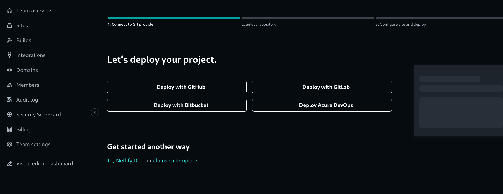

# Weekday: Frontend Interview Assignment

In this project, I used ReactJS, CSS, and also Responsive Design which works for different screen sizes.

### Run The App Locally

```bash
npm run install && npm start
```

### For build and Deployment for create-react-app

```bash
npm run build
```

Add this to package.json for deployment

```js
"build": "CI= react-scripts build",
```

### Deployment 📥

1. How do we deploy our project to the Netlify site?
2. I use [Netlify App](https://app.netlify.com/) for deploying my projects.
3. From there select **_Deploy with Github_**.
   
4. Then write your project name and select it.
5. After selecting here you can see that the project **_Review configuration for Weekday_** and then select the **_Deploy Weekday_** Button.
6. Now the project is Live.

---

### React Select: For multi-select

```bash
npm install react-select
```

### Filters

I hardcoded the filters into **_data.js_** for the jobs listing based on:

- Min experience
- Company name
- Location
- Remote/on-site
- Tech stack
- Role
- Min base pay

###### Note

Number of Employees wasn't in the API, so I didn't filter that.

---

# Cloning the project 🪛

```bash
# Clone this repository
$ git clone https://github.com/MastooraTurkmen/Weekday.git

# Go inside the repository
$ cd Weekday
```

---

# Languages and Tools are used 🛠

1. **Languages && Technology Stack**

   - [HTML5](https://github.com/topics/html5)
   - [CSS3](https://github.com/topics/css3)
   - [JavaScript](https://github.com/topics/javascript)
   - [ReactJs](https://github.com/topics/reactjs)
   - [API](https://github.com/topics/api)

2. **Tools** 🔧
   - [Chrome](https://github.com/topics/chrome)
   - [Figma](https://github.com/topics/figma)
   - [VSCode](https://github.com/topics/vscode)
   - [Netlify](https://github.com/topics/netlify)
   - [GitHub](https://github.com/topics/github)
   - [Npm](https://github.com/topics/npm)

---

## Author 👩🏻‍💻

**Mastoora Turkmen**  
[LinkedIn](https://www.linkedin.com/in/mastoora-turkmen/)
<br>
[Github](https://github.com/MastooraTurkmen/)
<br>
[Twitter](https://twitter.com/MastooraJ22)
<br>
